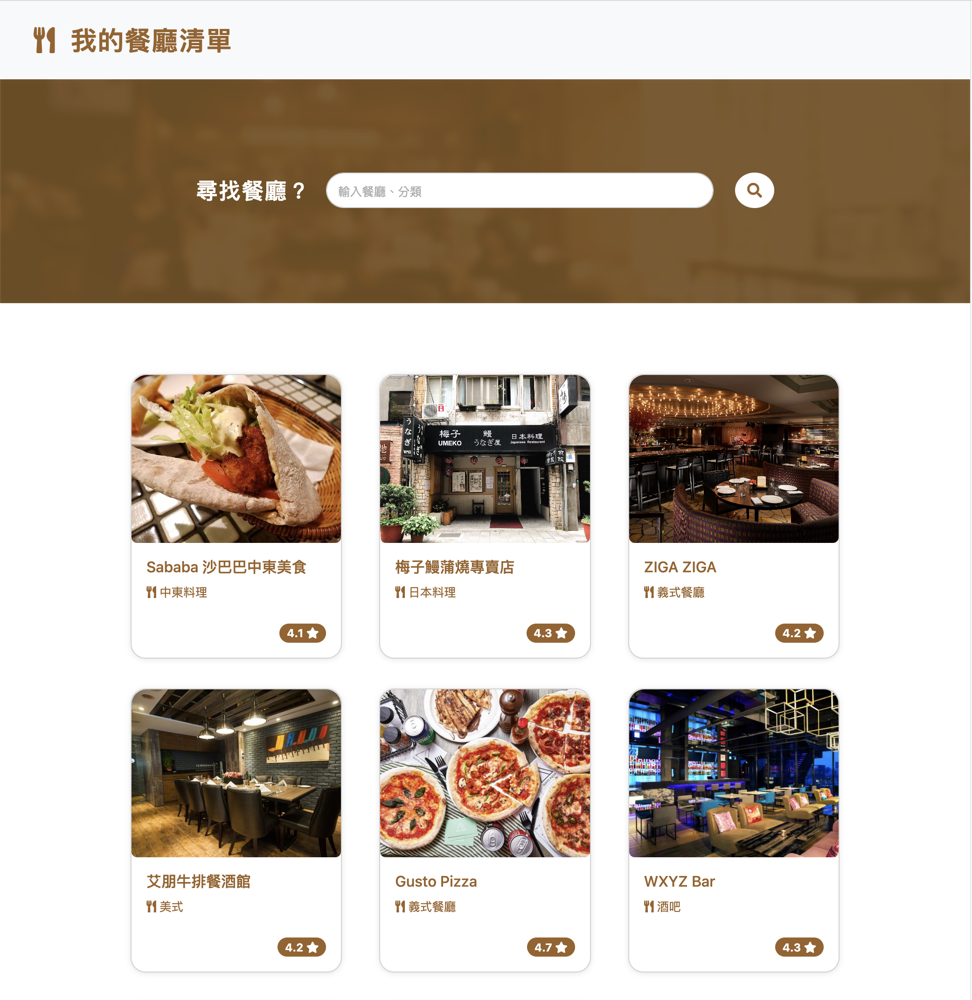

# Restaurant_20230416

Practicing Restaurant List

## Getting Started

These instructions will get you a copy of the project up and running on your local machine for development and testing purposes. See deployment for notes on how to deploy the project on a live system.

### Installing

A step by step series of examples that tell you how to get a development env running

- Install node.js
- Install npm
- Clone the repository to your local computer
- Open up the repository and type the following code in the terminal:

```
npm install
```

- Once Installed, go ahead and type:

```
npm run dev
```

- If you see the following sentence, it means that it is running smoothly. Open the browser and enter the following URL:

```
Express listening on http://localhost:3000
```

- If you want to exit from the Node console, type the following code:

```
ctrl + c
```

## Features

- Include express from node.js module
- Using handlebars for view engine
- Listing restaurant list from restaurant.json
- Searching restaurant by title or category
- Click restaurant card and open a new page for more information

### Searching

Type the title or category of the restaurant in search bar

### Show restaurant details

In index page, press the restaurant card,
then you can checkout the restaurant's detail in `show.handlebars`
press `我的電影清單` to go back to the index page.
